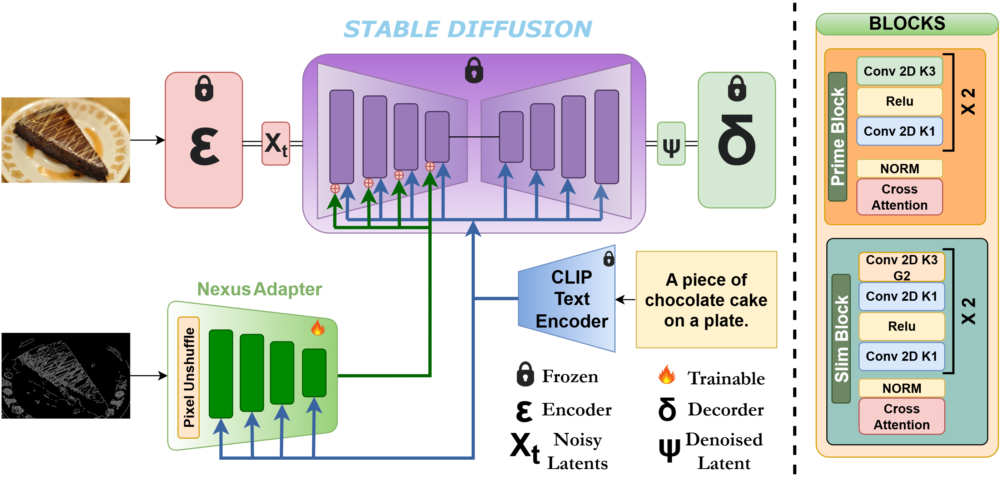

# Nexus Adapters: Efficient Text-Guided Convolutional Adapter for the Diffusion Model [WACV 2026]

<div style="background-color: white; padding: 20px; display: inline-block;">
  
</div>

## About

We introduce **Nexus Adapters**, novel text-guided efficient adapters for structure-preserving conditional generation using diffusion models. Existing approaches require redundant parameters and lack prompt awareness, making them computationally expensive.

## How to Run

### Image Generation

Use the `infer_image.ipynb` notebook for image generation with text-guided structural conditioning:

1. Open `infer_image.ipynb` in Jupyter
2. Follow the notebook cells to load the model and generate images
3. Provide text prompts and structural inputs
4. View generated outputs

### Training

Run the training script:

```bash
python train_1.5.py
```

Or use the provided shell script:

```bash
bash run.sh
```

## Project Structure

- `infer_image.ipynb` - Image generation and inference
- `train_1.5.py` - Training script
- `run.sh` - Execution script
- `models/adapter.py` - Adapter architecture
- `models/pipeline.py` - Diffusion pipeline
- `assets/` - Model images and resources

## Citation

If you find this work useful, please cite:

```bibtex
@inproceedings{nexus2026,
  title={Efficient Text-Guided Convolutional Adapter for the Diffusion Model},
  author={Aryan Das, Koushik Biswas, Swalpa Kumar Roy, Badri Narayana Patro, Vinay Kumar Verma},
  booktitle={Proceedings of the IEEE/CVF Winter Conference on Applications of Computer Vision (WACV)},
  year={2026}
}
```
